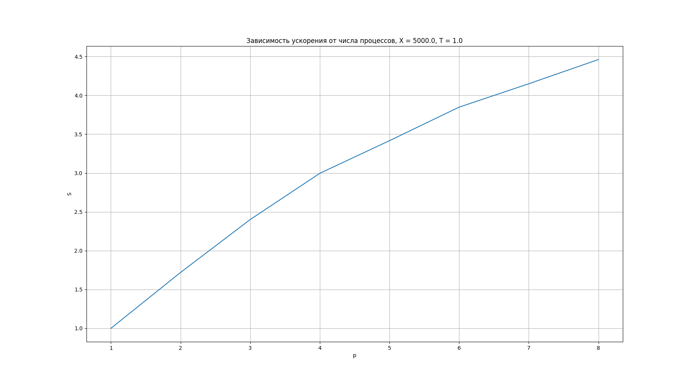
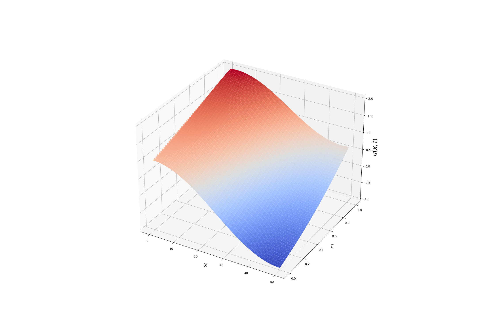

# Lab work 1
### Task

Solve the transfer equation

$$\begin{equation*} 
    \begin{cases}
        \frac{\partial u(t, x)}{\partial t} + a \frac{\partial u(t, x)}{\partial x} = f(t, x),~ 0 \leq t \leq T,~ 0 \leq x \leq X, \\
        u(0, x) = \varphi(x),~ 0 \leq x \leq X, \\
        u(t, 0) = \psi(t),~ 0 \leq t \leq T.
    \end{cases}
\end{equation*}$$

### Implementation details

$$\frac{u_{m}^{k+1} - u_m^{k-1}}{2 \tau} + a\frac{u_{m+1}^{k} - u_{m-1}^{k}}{2 h} = f_k^{k},~ k = \overline{0, K-1},~ m = \overline{0, M-1}$$

### Results

For instance with $X = 5000,~ T = 1,~ h = 0.05,~ \tau = 0.001$ maximum program aceleration is $\approx$ 4.5 times at 8 processes.

    

The solution was obtained for $f = \exp{(\sin{(xt)})},~ \varphi(x) = \cos{(\pi \frac{x}{X})},~ \psi(t) = e^{-t},~ a = 1$

$X = 50,~ T = 1,~ h = 0.05,~ \tau = 0.001$ 

    

