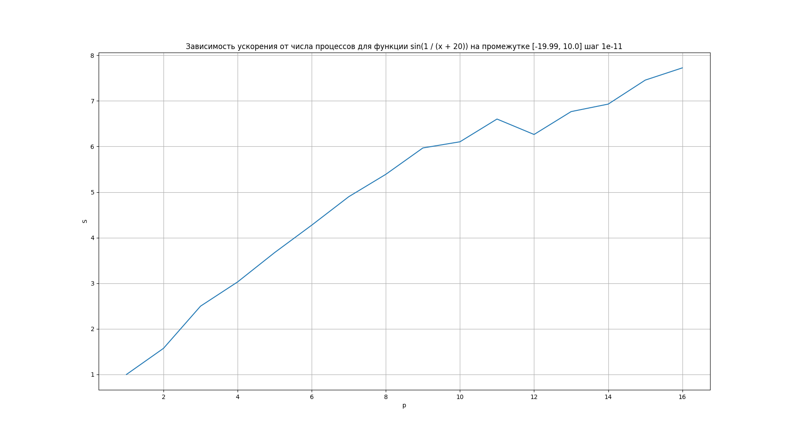

# Lab work 2
### Task

Integrate a derivative function  on a given segment

### Implementation details

In a nutshell, the task is done using local and global stacks. Each thread has its own local stack and when it is sufficienty full, it's shifted to the global one. And then other threads, if they don't have enough work, can take tasks from the global stack.
### Results

For function $\frac{1}{(x - 1)^2},~ [0, 0.99]$ the following graph is obtained:

    

For function $\sin{\left(\frac{1}{x + 20}\right)},~ [-19.99, 10.0]$ the following graph is obtained:

    

